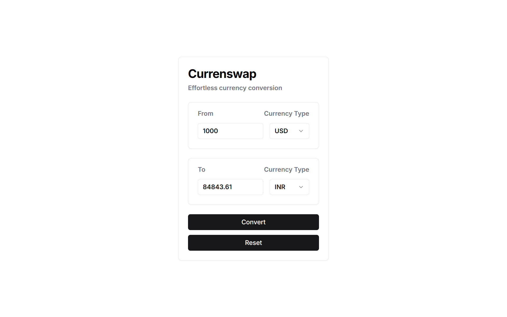

# Currenswap

Currenswap is a React-based web application designed for effortless currency conversion. Built with Vite for fast development and Tailwind CSS for styling, the app provides a user-friendly interface to convert amounts between different currencies. Users can select base and target currencies, input the amount to convert, and get the converted amount instantly. The app leverages the Free Currency API for real-time exchange rates and includes features like error handling and a reset button for convenience. The UI components are modular and reusable, ensuring a clean and maintainable codebase.

## Features
- Real-time currency conversion
- Selectable base and target currencies
- Error handling for invalid inputs
- Reset button to clear inputs
- Modular and reusable UI components